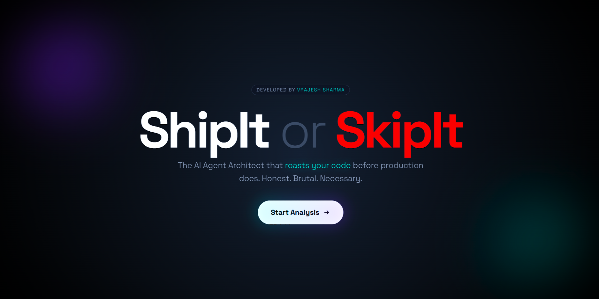
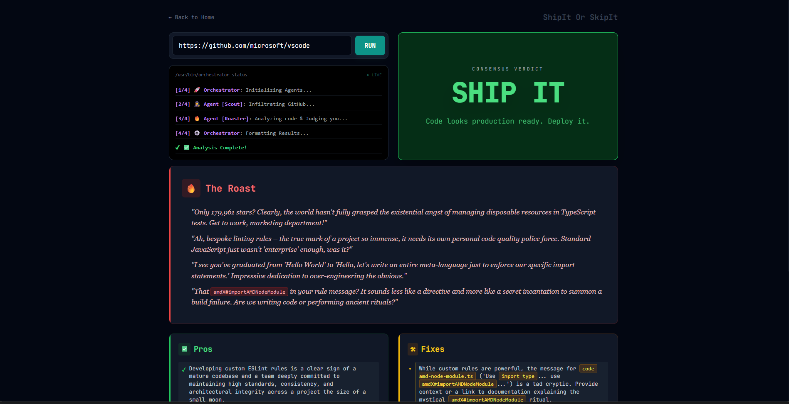

# 🚀 ShipIt or SkipIt?

> **The brutally honest AI code reviewer that cares (mostly).**

  

**ShipIt or SkipIt** is an AI-powered code review tool. It infiltrates public GitHub repositories, analyzes file structures, reads code snippets, and delivers a harsh but constructive verdict: **Ship It**, **Almost There**, or **Skip It**.





---

## 🧠 The Architecture (Orchestrator Pattern)

Unlike standard AI wrappers that crash on rate limits, this project uses a custom **Orchestrator Agent Pattern** to remain lightweight and quota-efficient.

1.  **🕵️ Scout Agent (Pure Python):** Uses the GitHub REST API to fetch metadata, file trees, and key code files without touching the LLM (saving tokens).
2.  **🔥 Roaster Agent (Gemini 2.5):** Takes the structured data from the Scout and performs a `single, high-density API call` to generate the verdict, roast, and fixes in strict JSON.
3.  **🧠 Orchestrator:** Manages the workflow and streams real-time updates (Server-Sent Events) to the frontend.

---

## 🛠️ Tech Stack

* **Backend:** Python, Flask, Google Generative AI.
* **Frontend:** Vanilla JavaScript, HTML5, TailwindCSS (CDN).
* **Streaming:** Server-Sent Events (SSE) for real-time terminal logs.
* **Deployment:** Ready for Render.

---

## 📂 Project Structure

A clean structure designed for modularity and maintainability.

```bash
ShipOrSkip/
├── agents/                 # 🧠 The Brains
│   ├── scout.py            # Fetches GitHub data (No AI)
│   ├── roaster.py          # Calls Gemini (AI)
│   └── orchestrator.py     # Manages the workflow
├── static/                 # 🎨 Assets (CSS/JS)
├── templates/              # 📄 HTML Views
│   ├── landing.html        # Hero Page
│   └── analyze.html        # Main Dashboard
├── app.py                  # 🚀 Application Entry Point
├── requirements.txt        # Dependencies
├── README.md               # You are here
└── .env                    # Secrets
```
## ⚡ Getting Started

Follow these steps to run the reviewer locally.

### 1. Clone the Repository
```bash
git clone https://github.com/Vrajesh-Sharma/ShipOrSkip.git
cd ShipOrSkip
```
### 2. Set Up Virtual Environment
```bash
python -m venv venv
# Windows
venv\Scripts\activate
# Mac/Linux
source venv/bin/activate
```

### 3. Install Dependencies
```bash
pip install -r requirements.txt
```

### 4. Configure Environment
Create a `.env` file in the root directory:
```bash
GOOGLE_API_KEY=your_gemini_api_key_here
GITHUB_TOKEN=your_github_token_here
```

### 5. Run the App
```bash
python app.py
```
Open your browser and visit: http://127.0.0.1:5000

## 🧪 How It Judges
The AI looks for specific signals to determine quality:
* **❌ Skip It:** No `README`, hardcoded secrets (`API_KEY="123"`), massive files in root, no `.gitignore`, or "spaghetti code."
* **⚠️ Almost There:** Good structure but lacking tests, vague variable names, or poor documentation.
* **🚀 Ship It:** Clean architecture, modular agents, detailed `README`, type hinting, and error handling.

---

## 🤝 Contributing
Found a way to make the roast meaner? Or the code cleaner?
1. Fork the repo.
2. Create a feature branch (git checkout -b feature/amazing-feature).
3. Commit changes.
4. Open a Pull Request.

---

## 📜 License
Distributed under the MIT License. See `LICENSE` for more information.
